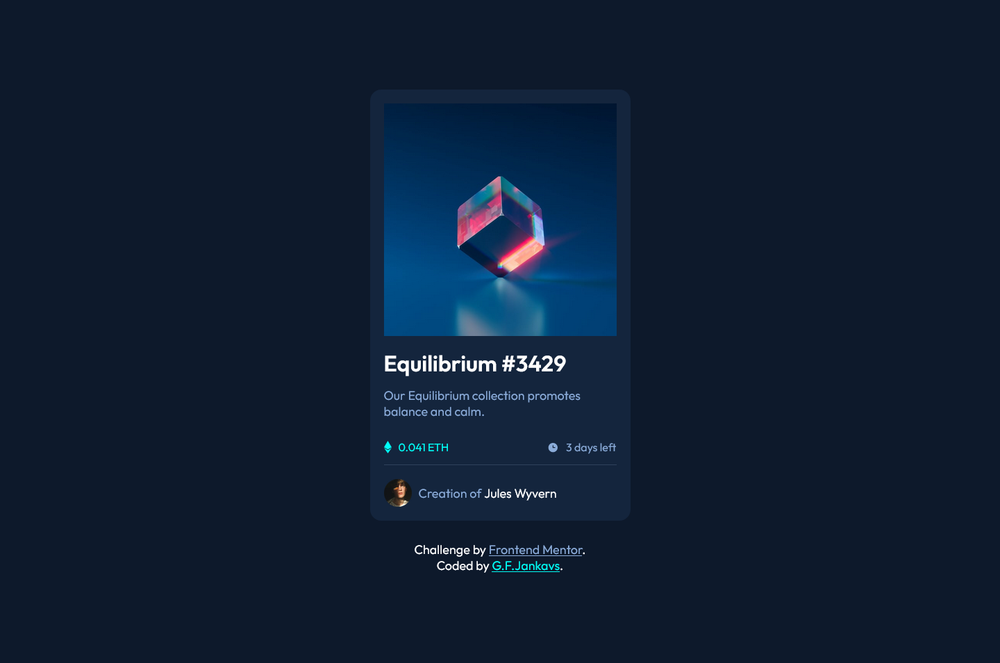
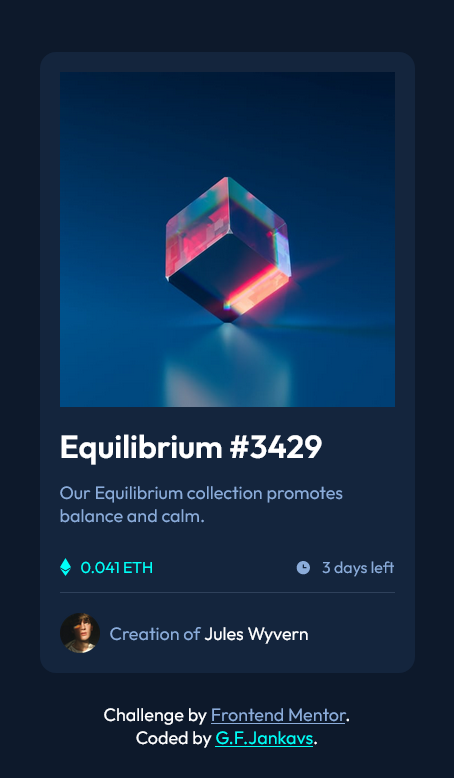

# Frontend Mentor - NFT preview card component solution

This is a solution to the [NFT preview card component challenge on Frontend Mentor](https://www.frontendmentor.io/challenges/nft-preview-card-component-SbdUL_w0U). Frontend Mentor challenges help you improve your coding skills by building realistic projects.

## Table of contents

- [Overview](#overview)
  - [The challenge](#the-challenge)
  - [Screenshot](#screenshot)
  - [Links](#links)
- [My process](#my-process)
  - [Built with](#built-with)
  - [Continued development](#continued-development)
- [Author](#author)

**Note: Delete this note and update the table of contents based on what sections you keep.**

## Overview

### The challenge

Users should be able to:

- View the optimal layout depending on their device's screen size
- See hover states for interactive elements

### Screenshot

### Links

- Solution URL: [Github Repo](https://github.com/GFJankavs/nft-preview-card-component)
- Live Site URL: [Github Pages](https://gfjankavs.github.io/nft-preview-card-component/)

## My process

### Built with

- Semantic HTML5 markup
- CSS custom properties
- Flexbox

### Continued development

Based on the comments that will be received for this challenge, going to make adjustments to the code base if necessary.

## Author

- Frontend Mentor - [@GFJankavs](https://www.frontendmentor.io/profile/GFJankavs)
- LinkedIn - [G.F.Jankavs](https://www.linkedin.com/in/gustavs-fricis-jankavs/)
- Twitter - [@GFJankavs](https://twitter.com/GFJankavs)
